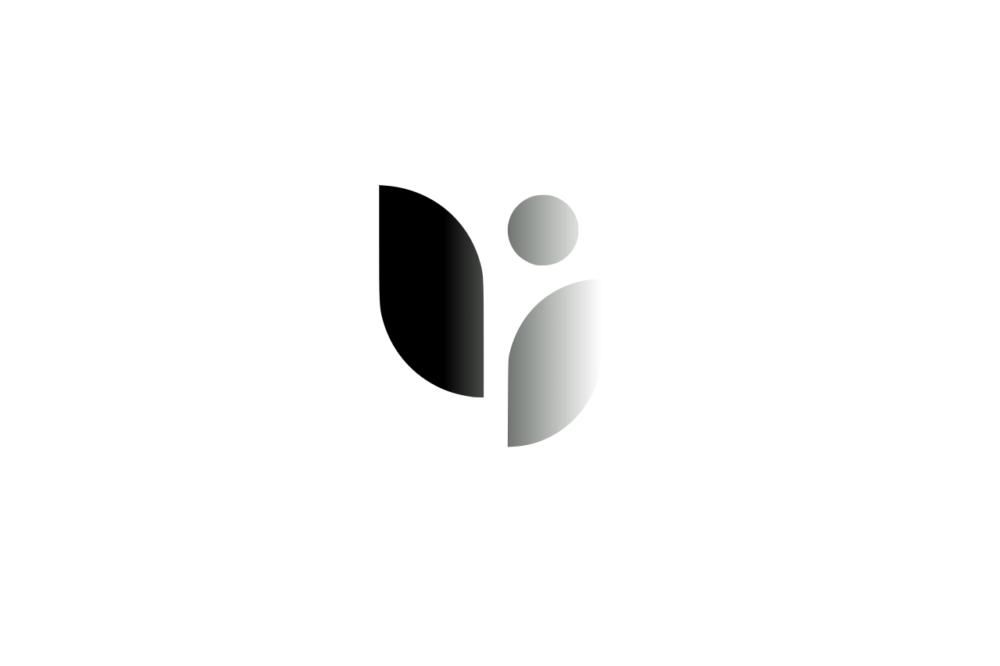

## Ecommerce App

App is a web application framework with impressive, elegant syntax. Development part started with Docker sail and published on AWS with nginx
- [Admin Panel](https://filamentphp.com/)
- [Mail verifications](https://mailtrap.io/).
- Docker with Nginx and [Sail](https://laravel.com/docs/10.x/sail).

Admin,User Dashboard with different roles and permissions.

## License

The Laravel framework is open-sourced software licensed under the [MIT license](https://opensource.org/licenses/MIT).

